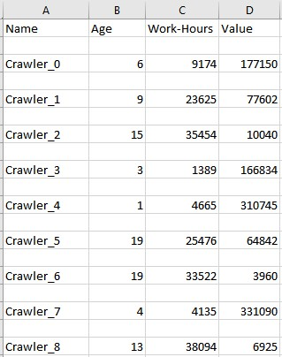

% Optimizing the Aquisition of Heavy Equiptment for Small Businesses
% David Hill, Jr.
% April 2020

## Introduction

* With this project will introduce a decision analysis tool to help real estate development companies evaluate decisions for the acquisition of real-estate development equiptment. 

* The target decision maker for this tool is the owner or executive of a small-medium sized real-estate development company. 

* For companies of this nature, financial resources are often limited so it is imperitive for them to make a wise decision regarding the acquisition of heavy equiptment. 

* The goal of this project is to augment a classic rent vs buy analysis with a catastrophic failure analysis of equiptment based on use.

## Motivation

* A poor acquisition decision can lead to project failure, injury to personnel and significant loss of capital which can be crippling to a small business. 

* Making the right acquisition decisons can greatly improve the financial posture of the business by reducing cost and risk.

* Inform decision makers as to which method of acquisition makes sense for their business and what condition of equiptment they should acquire to meet their goals.

## Decision Problem

* The main decision the business owner must make is whether they should buy or lease the equiptment, should they buy with a loan or in cash, and what condition of equiptment should they buy (new, used, or very used).

## Decision Problem Cont'd

We define the decision maker's action set $\ A$ as the set of actions the user can make within our decision tool.

## Decision Problem: Action Set

Let $\alpha_{1}$, $\alpha_{2}$ ,..., $\alpha_{n} \in \ A$

where: 

$\alpha_{1}$ = Buy a new bulldozer with cash

$\alpha_{3}$ = Buy a new bulldozer with loan

$\alpha_{5}$ = Rent a bulldozer

$\alpha_{6}$ = Buy a used bulldozer with cash

$\alpha_{6}$ = Buy a used bulldozer with loan

## Decision Problem: State Space

We define the state space $\ X$ as the set of possible outcomes.

Let $\chi_{1}, \chi_{2} \in \ X$

where:

$\chi_{1}$ = 1, The bulldozer suffers a catastrophic failure

$\chi_{2}$ = 0, The bulldozer does not suffer a catastrophic failure.

We assume our random variable will take the form of a Poisson distribution over a period of time. 

## Decision Problem: Parameter Space

We define the parameter space $\Theta$ as the set of unobserved parameters that will represent the period of time until a 
catastrophic failure is expected.

Let $\theta_{1}$, $\theta_{2}$ ,..., $\theta_{n} \in \Theta$

where:

$\theta_{1}$ = The probability of a catastrophic mechanical failure in the next 5 years

$\theta_{2}$ = The probability of a catastrophic mechanical failure in the next 10 years

$\theta_{3}$ = The probability of a catastrophic mechanical failure in the next 15 years

## Poisson Distribution

Expresses the probability of a given number of events occurring in a fixed interval of time or space if these events occur with a known constant mean rate and independently of the time since the last event.

A discrete random variable $\chi$ is said to have a Poisson distribution with parameter $\lambda$ > 0, if, for $\chi$ = 0, 1, 2, ..., the probability mass function of $\chi$ is given by:

$P(\chi = \ X) = \frac{\lambda^{\chi} \times e^{-\lambda}}{\chi !}$

where:

$\mu = \lambda$

$\sigma^{2} = \lambda$

$e = 2.71828...$

## Data

* Difficult to find bulldozer failure data

* Generate data sets using python based on used bulldozer sellers

* Bulldozer price is mainly based on work hours, age plays a small factor

* Data set represents bulldozers that filed in a year

* With this data set we can calculate the failure rate and lambda values for our poisson function

## Data: Cont'd

## Decision Problem: Example

According to collected bulldozer failure data, the average failure rate for a bulldozer with 50,000 work hours is 0.7 catastrophic failures per year. Failures follow a Poisson distribution. What is the probability that this bulldozer will experience a catastrophic failure in the next 5 years?

$\chi$ = number of failures expected = 1

$\lambda = .7 * 5 = 3.5$

$P(\chi = 1) = \frac{\lambda^{\chi} \times e^{-\lambda}}{\chi !} = \frac{3.5^{1} \times e^{-3.5}}{1!} = 0.10569$

Thus, within a 5 year period, a bulldozer with 50,000 work hours has a 10.6% chance of experiencing a catastrophic failure.

## Predictive Model

* The novel predictive value this tool will provide is it's ability to predict catastrophic equiptment failure given it's wear. This will reduce uncertainty for a decision maker who is assessing used equiptment options. 

* This uncertainty is directly related to the payoff of our decision model as there is a monetary benefit to purchasing a used piece of equiptment over new equiptment. However, used equiptment poses a higher risk of catastrophic mechanical failure.

## Value

* The value of this tool is in minimizing the cost of ownership for the decision maker. The tool helps decion makers weigh the pros and cons of renting, buying new, and buying used and helps balance risk v.s monetary benefit to accomplish the organization's goals.

* $Payoff_{risk} = P(\chi = 1) * TotalCost$

* The lower the number the better as we want to minimize risk.

## The End

 
